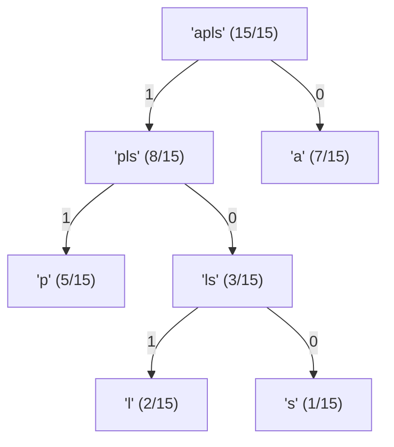

# Huffman-code

## Comment utiliser l'algorithme

_Work in progress_

## Qu'est ce que le codage de Huffman

### C'est un algorytme de compression de données

Le codage de Huffman est utilisé dans les formats de compression de type zip. Il utilise le fait que tous les symboles contenus dans un fichier n’ont pas la même probabilité d’apparition. Le principe du codage de Huffman est de coder les symboles les plus probable par des mots courts et les symboles les plus rares par des mots longs.
Vous connaissez le code ASCII qui code tous les symboles : lettres, chiffre, caractères spéciaux sur 7 ou 8 bits. Ceux-ci ont tous la même longueur. Dans le codage de Huffman les symboles vont être codés sur des longueurs différentes. Pour pouvoir décoder le message alors que l’on ne connait pas la longueur des symboles, on utilise une propriété remarquable du codage de Huffman : le codes binaires préfixes.

Aucun code de symbole n’est le début d’un autre du coup, on sait facilement lire chaque symbole.

### Codage de Huffman, l’algorithme

```
Initialisation
Liste des noeuds candidats :
    chaque symbole à codes est un noeud pondéré
    dont le poids est la probabilité.

Tant que
    nous avons au moins deux noeuds dans la liste des noeauds candidats
    - On identifie les deux noeuds de poinds le plus faible de la liste actuelle
    - On les remplace par un père dont le poids sera la somme
```

L’algorithme de Hoffman construit récursivement un arbre binaire pondéré avec la somme des poids égale à 1.
A chaque étape on trouve un père à deux nœuds.
A chaque étape la somme des poids restera égale à 1.

### Mais comment coder Huffman

Pour coder on utilisera une suite de `0` et de `1`, nous allons déterminer le symbole de chaque caractère saisi. On regroupe 2 à 2 les symboles les moins fréquents on attribue `1` au plus fréquent et `0` au moins fréquent.

### Exemple

Pour coder la chaine de 15 caractères `"palapapapapalas"`

L’alphabet est composé de quatre symboles `p`,`a`,`l`,`s`

On a le graphe suivant :



Pour l'alphabet, on obtient le tableau suivant :

| caractère | Nombre d’occurrences | Probabilité | Code Huffman | Longueur du code (en nombre de caractères) |
| :-------: | :------------------: | :---------: | :----------: | :----------------------------------------: |
|     a     |          7           | 7/15 = 0.46 |      0       |                     0                      |
|     l     |          2           | 2/15 = 0.13 |     101      |                     3                      |
|     p     |          5           | 5/15 = 0.33 |      11      |                     2                      |
|     s     |          1           | 1/15 = 0.06 |     100      |                     3                      |

On obtient donc le résultat suivant comme codage Huffman :

`11` `0` `101` `0` `11` `0` `11` `0` `11` `0` `11` `0` `101` `0` `100`

<br/>
<br/>

En entrée, on a le code ASCII

`01010000` `01000001` `01001100` `01000001` `01010000` `01000001` `01010000` `01000001` `01010000` `01000001` `01010000` `01000001` `01001100` `01000001` `01010011`
_(longeur : 120bits)_

En sortie, En sortie, avec l’algorithme, on a le code Huffman

`11` `0` `101` `0` `11` `0` `11` `0` `11` `0` `11` `0` `101` `0` `100`
_(longeur : 26bits)_

```

```
